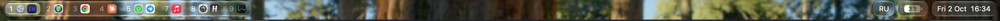

# vsnd-setup



One command to set up a tiling macOS desktop:

- **[AeroSpace](https://github.com/nikitabobko/AeroSpace)** (i3-like tiling window manager), built from source with
  [a few patches](https://github.com/vsndrg/aerospace#patches) — smoother workspace switches, better multi-monitor
  behaviour, and a socket that pushes its state to the bar;
- **[VsndBar](https://github.com/vsndrg/vsndbar)** — a Liquid Glass bar in place of the menu bar: workspaces with
  their app icons, keyboard layout, battery, clock. One small Swift process, no polling;
- **Karabiner-Elements** keys: F3/F4/F5 screenshots, F6 sleep (and Sidecar iPads reconnect after wake).

```sh
curl -fsSL https://raw.githubusercontent.com/vsndrg/vsnd-setup/main/install.sh | bash
```

It shows what it will do and asks before starting. Running it again is safe: every step checks what is already
there.

## Requirements

- Apple Silicon Mac, **macOS 26** (Tahoe) or newer — the bar is Liquid Glass.
- Command Line Tools (`xcode-select --install`; the installer opens it if they are missing). Xcode is not needed.
- [Homebrew](https://brew.sh) (the installer offers to install it).

## What the installer does

| Step | Details |
|---|---|
| Configs | Clones [vsndrg/aerospace](https://github.com/vsndrg/aerospace) and [vsndrg/vsndbar](https://github.com/vsndrg/vsndbar) into `~/.config/aerospace` and `~/.config/vsndbar`. Whatever was there (and `~/.aerospace.toml`) is moved to `*.backup-<date>`. |
| Certificate | Creates a self-signed code signing certificate `aerospace-local-codesign` in the login keychain. Apps signed with it keep their Accessibility permission across rebuilds. macOS asks for your password once to trust it. |
| AeroSpace | Downloads the AeroSpace **0.20.3-Beta** release (checksum verified), builds it with the patches and installs it into `/Applications`. The CLI goes to `$(brew --prefix)/bin/aerospace`. If AeroSpace was installed with Homebrew, the cask is removed — `brew upgrade` would replace the patched app with a newer one the patches don't fit. |
| VsndBar | Builds the bar into `~/Applications/VsndBar.app` and starts it as a LaunchAgent (`com.vsndrg.vsndbar`, restarts if it quits, starts at login). CLI: `~/.local/bin/vsndbar`. |
| Menu bar | Sets *System Settings → Control Center → Automatically hide and show the menu bar* to **Always**: the bar lives under it. |
| Karabiner | Installs Karabiner-Elements and adds four keys to the selected profile; the rest of your Karabiner config is kept (a backup is saved next to it). |
| Screenshots | Moves the system shortcuts F3/F4 use, saves screenshots to `~/Screenshots`. |

The previous values of every macOS setting it changes are saved in `~/.local/state/vsnd-setup/settings.json`;
`uninstall` puts them back.

### After installing

- **Accessibility for AeroSpace**: allow it when macOS asks (System Settings → Privacy & Security → Accessibility).
  The certificate makes this a one-time grant.
- **Karabiner-Elements** (first install): follow its setup — allow the driver extension and Input Monitoring.
- The first build may ask *“codesign wants to use the key aerospace-local-codesign”*: choose **Always Allow**.

## Keys

AeroSpace (`~/.config/aerospace/aerospace.toml`):

| Keys | Action |
|---|---|
| `cmd-1` … `cmd-0` | workspace 1–10, on the monitor where it lives; pressed again — back to the previous one; held — only a peek: released, back to where you were |
| `cmd-shift-1` … `0` | move the window to workspace N |
| `cmd-alt-1` … `0` | bring workspace N to the focused monitor |
| `cmd-j` / `cmd-k` | focus left / right |
| `cmd-ctrl-h/j/k/l` | move the window |
| `cmd-h` / `cmd-l` | narrower / wider (`cmd-r`: resize mode, `hjkl`, `esc`) |
| `cmd-shift-j` / `cmd-shift-k` | focus the previous / next monitor |
| `cmd-shift-h` / `cmd-shift-l` | move the whole workspace to the previous / next monitor |
| `cmd-u` | tiles ↔ accordion |
| `cmd-i`, `cmd-e` | horizontal ↔ vertical |
| `cmd-shift-space` | floating ↔ tiling |
| `cmd-shift-b` | swap the glass bar and the system menu bar |
| `cmd-shift-c` | reload the config |
| `cmd-b` | new Google Chrome window (personal — change it in the config) |

Karabiner:

| Key | Action |
|---|---|
| `F3` / `cmd-F3` | screenshot of the screen → file / clipboard |
| `F4` / `cmd-F4` | screenshot of an area → file / clipboard |
| `F5` | the Screenshot toolbar (recording, options) |
| `F6` | sleep: ends Sidecar sessions first (else the iPad stays lit); they reconnect after wake |

The bar: click a workspace to switch to it, the keyboard layout to switch to the next input source, the battery
for its menu, the clock for Calendar.

## Update, uninstall, options

```sh
~/.config/vsnd-setup/install.sh update      # pull this repo, then install again
~/.config/vsnd-setup/install.sh uninstall   # remove the bar, back to stock AeroSpace and your settings
```

| Option | |
|---|---|
| `--yes` | don't ask |
| `--no-karabiner` | skip Karabiner-Elements and the screenshot settings |
| `--force` | rebuild AeroSpace even if the patches didn't change |

With `curl … | bash`, pass options as `curl … | bash -s -- --no-karabiner`.

`update` moves `~/.config/aerospace` and `~/.config/vsndbar` forward to the commits this repo pins, never back, and
leaves a checkout with local changes alone. AeroSpace is rebuilt only when its patches change; the bar is rebuilt
when its sources change.

`uninstall` leaves your configs, the certificate and Karabiner-Elements in place and prints how to remove them.

## Customizing

- Keys, gaps, startup: `~/.config/aerospace/aerospace.toml`, then `cmd-shift-c`. The gaps match the bar (one 6pt gap
  everywhere); see the comments there if your external display's menu bar isn't 30pt.
- The bar: `~/.config/vsndbar/Sources/Config.swift` (glass, gap, corner radius, animations), then
  `make -C ~/.config/vsndbar install`.
- Patches: `~/.config/aerospace/patches/`, then `~/.config/aerospace/patches/build.sh --install`.

## Troubleshooting

- **The bar doesn't show workspaces** — AeroSpace isn't running or isn't the patched build:
  `aerospace --version` should print `0.20.3-Beta` for both the client and the server. Re-run the installer with `--force`.
- **Windows don't tile** — AeroSpace has no Accessibility permission (see above). After granting it, restart AeroSpace.
- **F-keys do nothing** — Karabiner-Elements needs its driver and Input Monitoring permission; open the app.
- **Logs** — the bar: `~/.local/state/vsndbar/` (`daemon.log`, `launch.log`, `sleep.log`);
  the last AeroSpace build: `~/.local/state/vsnd-setup/aerospace-build.log`.

## Repositories

| Repo | |
|---|---|
| [vsndrg/vsnd-setup](https://github.com/vsndrg/vsnd-setup) | this installer; pins compatible commits of the other two as submodules |
| [vsndrg/aerospace](https://github.com/vsndrg/aerospace) | `aerospace.toml`, the patches and their build script |
| [vsndrg/vsndbar](https://github.com/vsndrg/vsndbar) | the bar (Swift) |

To pin the newest commits of both (maintainers): `./bump.sh`, then push.
